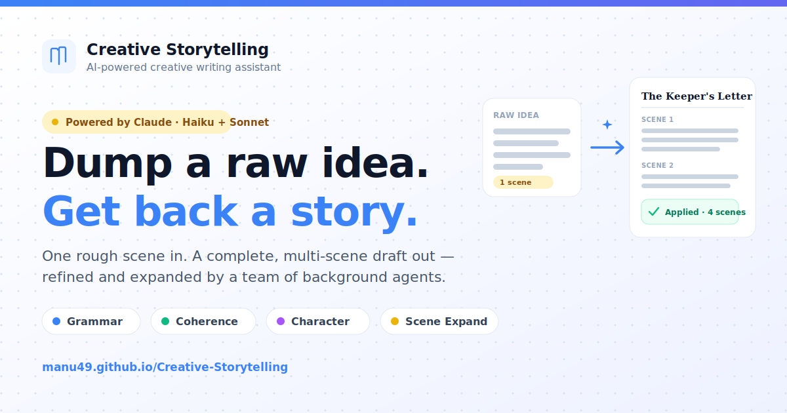

# Creative-Storytelling

A web-based creative writing assistant powered by Claude AI. Writers dump raw ideas (scenes, dialogues, characters), and an agentic AI framework generates and refines the full story in the background while you continue writing.

## Live Demo

**[manu49.github.io/Creative-Storytelling](https://manu49.github.io/Creative-Storytelling/)**

No setup required — the demo runs entirely in your browser. Drop in a single raw scene and watch a team of Claude agents (Haiku + Sonnet) expand it into a complete, multi-scene draft in real time, with accept/reject suggestions streamed back live.

[](https://manu49.github.io/Creative-Storytelling/)

## Features

- **Idea Dump**: Quickly capture raw creative ideas in text or voice
- **AI-Powered Refinement**: Background agents continuously improve:
  - Grammar and style corrections
  - Story coherence and narrative flow
  - Character consistency and arc development
  - Scene expansion and dialogue generation
- **Real-Time Collaboration**: See AI suggestions stream in as they're generated
- **Rich Editing**: Tiptap-powered Markdown editor with scene navigation
- **Story Export**: Download your story as Markdown or PDF
- **Local-First**: SQLite + FAISS for local development, no external services

## Tech Stack

- **Frontend**: Next.js 15 + React 19 + TypeScript + Tailwind CSS
- **Backend**: FastAPI + SQLAlchemy async + SQLite
- **AI/LLM**: Claude API (Haiku + Sonnet) via Anthropic SDK
- **RAG**: Sentence-Transformers + FAISS for context retrieval
- **Real-Time**: WebSockets for streaming agent events

## Quick Start

### Prerequisites

- Node.js 18+
- Python 3.9+
- Docker & Docker Compose (recommended)
- Anthropic API key

### Development (with Docker)

```bash
# Clone and setup
cd creative-storytelling
cp .env.example .env

# Add your ANTHROPIC_API_KEY to .env

# Start services
docker-compose up
```

Visit:
- Frontend: http://localhost:3000
- Backend API: http://localhost:8000/docs (Swagger)

### Development (Manual Setup)

#### Backend

```bash
cd backend
python -m venv venv
source venv/bin/activate
pip install -e .
alembic upgrade head
uvicorn app.main:app --reload
```

#### Frontend

```bash
cd frontend
npm install
npm run dev
```

## Architecture

See [PLAN.md](./.claude/plans/immutable-petting-quilt.md) for detailed architecture documentation.

### High-Level Flow

1. User creates a story and adds scenes/ideas
2. Each scene save triggers agentic tasks (grammar fix, coherence check)
3. Agent worker polls task queue every 3 seconds
4. Specialized agents run (Haiku for grammar, Sonnet for deeper analysis)
5. Suggestions stream to frontend via WebSocket in real-time
6. User accepts/rejects suggestions → scene content updates + RAG re-indexes

### Agentic Agents

| Agent | Model | Task |
|---|---|---|
| GrammarAgent | Haiku | Detect typos, grammar issues, style improvements |
| CoherenceAgent | Sonnet | Check narrative flow, plot consistency, pacing |
| CharacterAgent | Sonnet | Verify character arcs, consistency, motivation |
| SceneExpandAgent | Sonnet | Turn raw ideas into full scene drafts |

## API Documentation

Once running, visit `http://localhost:8000/docs` for interactive Swagger documentation.

### Key Endpoints

- `POST /stories` — Create a new story
- `GET /stories/{id}` — Fetch story with all scenes and characters
- `POST /stories/{id}/scenes` — Add a new scene (triggers agents)
- `POST /stories/{id}/ideas` — Dump raw idea (Sonnet expands into scene)
- `PUT /stories/{id}/agent-tasks/{task_id}/accept` — Apply AI suggestion
- `WS /ws/{story_id}` — WebSocket for real-time agent events

## Project Structure

```
creative-storytelling/
├── backend/                 # FastAPI app
│   ├── app/
│   │   ├── agents/         # Grammar, Coherence, Character, SceneExpand agents
│   │   ├── models/         # SQLAlchemy ORM models
│   │   ├── routers/        # API endpoints
│   │   ├── schemas/        # Pydantic I/O schemas
│   │   ├── services/       # LLM, RAG, StoryManager services
│   │   └── ws/             # WebSocket management
│   └── pyproject.toml
├── frontend/                # Next.js app
│   ├── src/
│   │   ├── app/           # Pages
│   │   ├── components/    # React components
│   │   ├── hooks/         # Custom hooks (WebSocket, etc.)
│   │   ├── lib/           # Utilities (API client, export)
│   │   ├── store/         # Zustand state management
│   │   └── types/         # TypeScript types
│   └── package.json
└── docker-compose.yml
```

## Development Tips

### Debugging

- **Backend logs**: `docker logs creative-storytelling-backend`
- **Frontend logs**: `docker logs creative-storytelling-frontend`
- **API Explorer**: http://localhost:8000/docs

### Environment Variables

Edit `.env` to change:
- `ANTHROPIC_API_KEY` — Your Claude API key
- `HAIKU_MODEL` / `SONNET_MODEL` — Model versions
- `AGENT_POLL_INTERVAL_SECONDS` — How often worker checks queue
- `AGENT_MAX_CONCURRENT_TASKS` — Concurrency limit

### Database

SQLite db stored in `./data/creative_storytelling.db`. To reset:

```bash
rm data/creative_storytelling.db
docker-compose restart backend  # or: alembic upgrade head
```

## License

MIT
